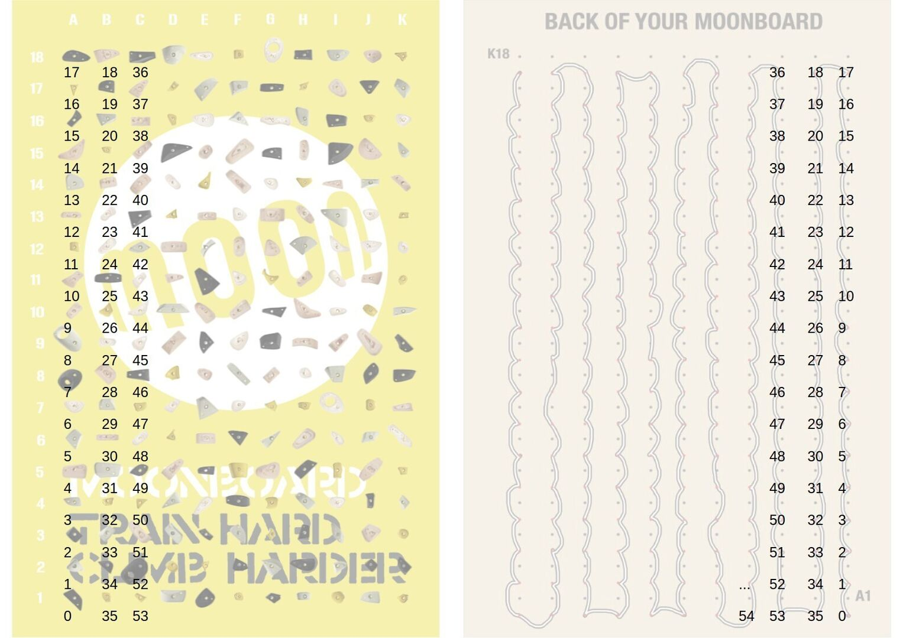
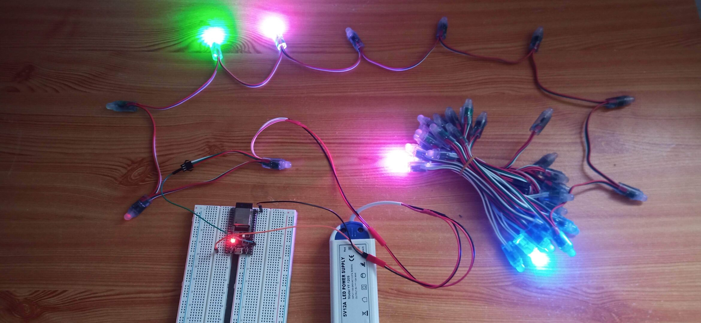
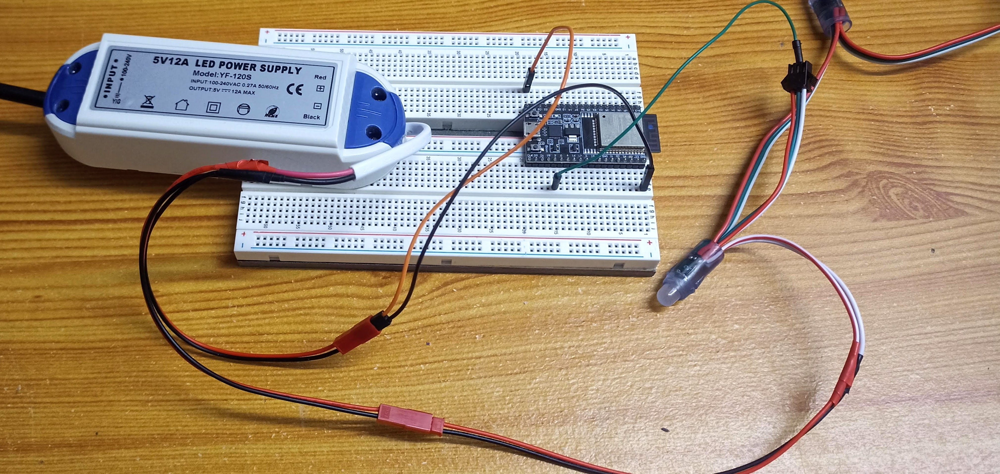
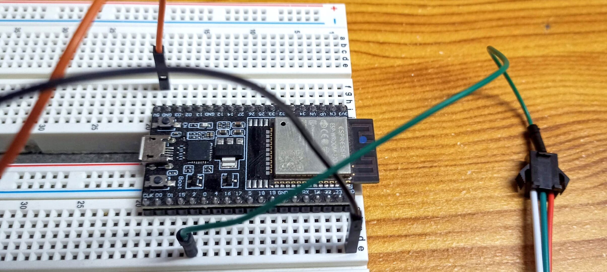
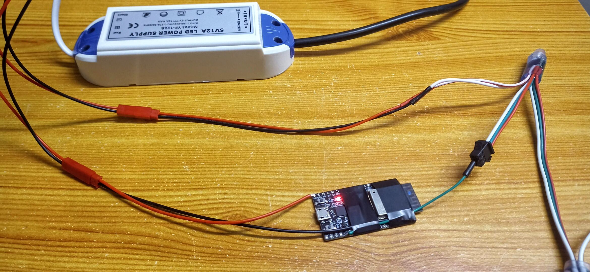
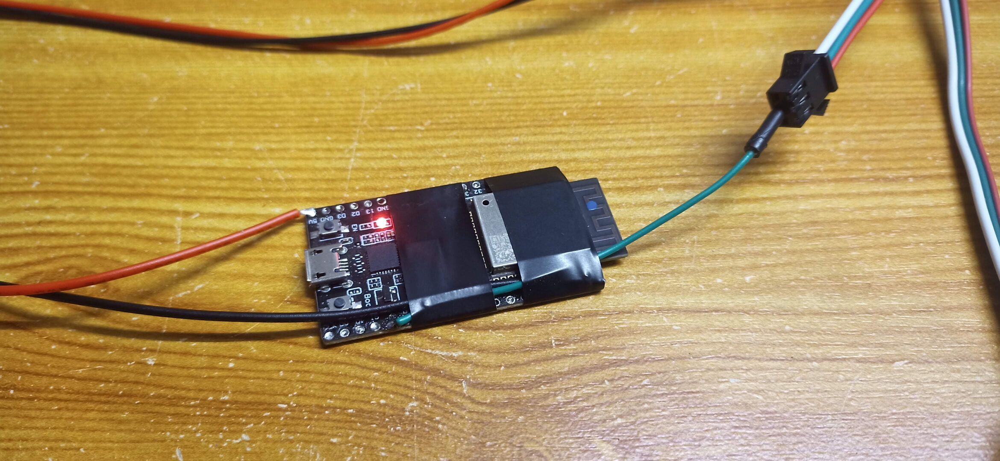

# Moonboar ESP32 LED BLE: A Simple MoonBoard BLE LED System

This project started as a fork of the very good [Moonboard LED on Arduino 33 BLE](https://github.com/FabianRig/ArduinoMoonBoardLED) project in order to add ESP32 chip support. But since then, the project has been almost completely rewritten for the BLE and problem processing parts. On top of that the BLE libraries are incompatible between Nano 33 BLE and ESP32 chips. So another project was born!

This project aims at providing an easy to use solution for building your own MoonBoard LED system. It is both compatible with a normal MoonBoard as well as with the MoonBoard Mini. 

If you want a product that just works, please buy the one offered by Moon Climbing it isn't that expensive for the provided service and will save you a lot off time and energy! This is a project for people having fun building things by themself and knowing the downside of doing it. This project will requires some work and still might not work as well as the original. To be absolutely clear: This project is provided as-is. I take absolutely no responsibility that it works as expected. In fact, it might break at any time. You have been warned!

## Hardware

You need:
- An ESP32 Devkit development Board
- 4x (50pcs DC5V WS2811) with 25 cm wire length (or x8 with 15cm wire length and the LED_OFFSET constant set to 2)
- An appropriate power source

Power consumption: 
- WS2811 LED seems to draw 20mA for each channel color, so at full brightness (R: 255, G: 255, B: 255) it should be (3 * 20mA) = 60mA
- Standard Moonboard use 200 LEDs, if all LEDs are turned on white they'll draw (200 * 60mA /1000) * 5v = 60 Watts
- The max number LEDs turned on is when running the LEDs check at boot. It'll light each LEDs to the colors red, then green, then blue and eventually violet. The max power used is for the violet color at full brightness R and B (255, 0, 255) so aproximatly ( 200 * 40mA / 1000 ) * 5v = 40 Watts. Aiming for a 60 Watts power source should be a good idea. 

Example:
- [WS2811 5V 15cm](https://www.aliexpress.com/item/33044775305.html)
- [Power supply 5v 12A 60W](https://www.aliexpress.com/item/4000035882551.html)

## Thanks
All the heavy lifting in this project is done by two awesome libraries: [NeoPixelBus](https://github.com/Makuna/NeoPixelBus) (for the LED string) and [BLESerial](https://github.com/iot-bus/BLESerial) (for BLE functionality on ESP32). They make it possible to keep this project quite short, easy to understand, and easily maintainable.

Thanks to the two following projects for inspiration and proving this kind of project was easly doable on Arduino chip:
- [Moonboard LED sytem on Arduino NRF52](https://github.com/e-sr/moonboard_nrf52)
- [Moonboard LED on Arduino 33 BLE](https://github.com/FabianRig/ArduinoMoonBoardLED)

## How to use
1. Download and install Visual Studio Code.
2. Install PlatformIO in Visual Studio Code.
3. Download and open this project.
4. Adjust to your needs (Moonboard type, LED offset, LED pin).
5. Compile and flash to an EPS32.
6. Use the MoonBoard app to connect to the ESP32 and show the problems on your board!

## LED Mapping
The most common LED wiring pattern (here for a MoonBoard standard) goes like this (front view):
- Start bottom left (A1),
- Up the column (to A18),
- One column to the right (to B18),
- All the way down (to B1),
- One column to the right (to C1),
- And repeat.

The MoonBoard App encodes holds in the same way. Hold A1 is 0, hold A2 is 1, hold A3 is 2 and so on.

## Good to know
- Wiring: Usually, white is GND/negative, red is positive, green is data. Please double-check! It might be a good idea to use a resistor (e.g. 330 ohms) in the data line!
- Never power the Arduino only when it's connected to the LED string without powering the LED string! This might destroy the first LED!
- The Arduino does not need to be shutdown, you can simply unplug the power source! This is (at least for me) a big improvement when compared to a Raspberry Pi based solution.

## Pictures

